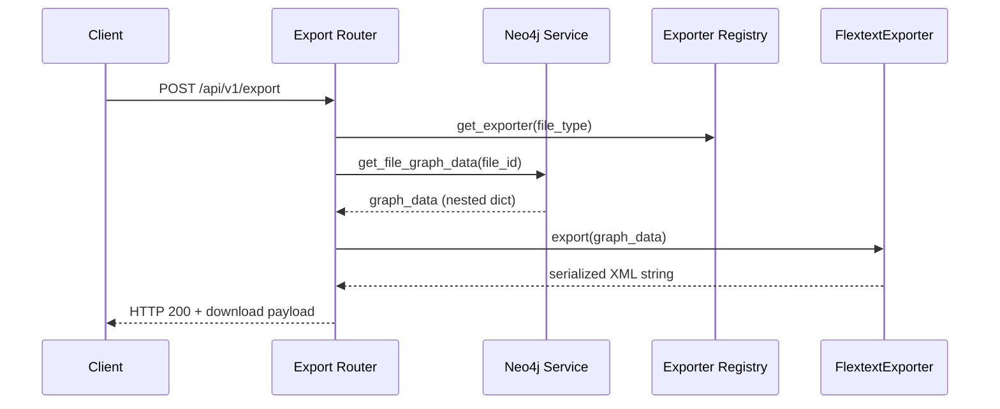

# Lexiconnect Export System

This document explains how the FlexText export feature is wired end to end, how data flows between the backend and frontend, and how to extend the system with additional exporters.

---

## API Surface

- **Endpoint:** `POST /api/v1/export`
  - **Query Parameters:**
    - `file_type` (optional, defaults to `flextext`)
  - **Body:**
    ```json
    {
      "file_id": "<text-id-from-neo4j>"
    }
    ```
  - **Response:**
    - Binary payload of the requested export format
    - `Content-Disposition` header sets the download filename using the exporter’s file extension (`<file_id>.<extension>`)
    - `X-Lexiconnect-Export` header exposes the resolved exporter type
- **Legacy alias:** `POST /api/v1/export/flextext` (still routed through the same handler; preferred entry point is `/api/v1/export`).

### Error Codes

| Status | Scenario                                                   |
| ------ | ---------------------------------------------------------- |
| 400    | Missing/blank `file_id` or unsupported `file_type`         |
| 404    | `file_id` does not resolve to a `Text` node in Neo4j        |
| 500    | Failure retrieving graph data or serializing the exporter  |

Every failure path is logged with contextual metadata (`file_id`, `file_type`) for easier debugging in Cloud Run.

---

## Backend Data Flow



### Key Modules

| Location                                         | Responsibility                                                    |
| ------------------------------------------------ | ----------------------------------------------------------------- |
| `backend/app/routers/export.py`                  | HTTP contract, validation, exporter lookup, response streaming    |
| `backend/app/services/neo4j_service.py`          | Collects `Text`, `Section`, `Phrase`, `Word`, `Morpheme` graph data|
| `backend/app/exporters/base.py`                  | Defines the exporter protocol and common exceptions               |
| `backend/app/exporters/__init__.py`              | Maintains the registry + registration helpers                     |
| `backend/app/exporters/flextext_exporter.py`     | Implements the `FlextextExporter` serializing graph data to XML   |

Neo4j data is returned as a nested dictionary shaped for exporters. The registry resolves the exporter implementation based on `file_type`; new exporters can be dropped in without modifying the router.

---

## Frontend Flow

The graph page (`frontend/app/components/GraphVisualization.tsx`) controls export UX.

1. User clicks **Export** → `ExportFileTypeModal` opens and pre-selects the available type (currently only `.flextext`).
2. When confirmed, the component issues:
   ```ts
   await fetch(`/api/v1/export?file_type=flextext`, {
     method: "POST",
     headers: { "Content-Type": "application/json" },
     body: JSON.stringify({ file_id }),
   });
   ```
3. The binary payload is streamed into a blob URL and downloaded in the browser. Real-time toast feedback reports success or backend error messages.

---

## Adding a New Exporter

1. **Create an exporter class** under `backend/app/exporters/<new_type>_exporter.py` implementing the `Exporter` protocol:
   ```python
   from app.exporters.base import Exporter

   class MyExporter(Exporter):
       file_type = "mytype"
       media_type = "application/octet-stream"
       file_extension = "myext"

       def export(self, graph_data: dict) -> str:
           ...
   ```

2. **Register the exporter** (ideally in `backend/app/exporters/__init__.py`) using `register_exporter(MyExporter())`.

3. **Optional frontend updates:**
   - Add the new flavor to `exportOptions` in `GraphVisualization.tsx` (label, extension, and endpoint if different).
   - Update tests/UX as required.

4. **Testing:** Extend `test_export_route.py` (or create a dedicated suite) to mock your exporter and assert correct headers/payloads.

---

## Example Cypher Queries

These are representative snippets used by `get_file_graph_data` (see the service for the full queries):

```cypher
// Text metadata
MATCH (t:Text {ID: $text_id})
RETURN t.ID AS id, t.title AS title, t.source AS source,
       t.comment AS comment, t.language_code AS language_code;

// Sections ordered by `Section.order`
MATCH (t:Text {ID: $text_id})-[:SECTION_PART_OF_TEXT]->(s:Section)
RETURN s.ID AS id, s.order AS order
ORDER BY order, id;

// Phrases per section
MATCH (s:Section)-[:PHRASE_IN_SECTION]->(p:Phrase)
WHERE s.ID IN $section_ids
RETURN s.ID AS section_id, p.ID AS id, p.segnum AS segnum,
       p.surface_text AS surface_text, p.language AS language, p.order AS order;

// Words (with optional morphemes)
MATCH (p:Phrase)-[r:PHRASE_COMPOSED_OF]->(w:Word)
WHERE p.ID IN $phrase_ids
OPTIONAL MATCH (w)-[rm:WORD_MADE_OF]->(m:Morpheme)
RETURN p.ID AS phrase_id, w.ID AS word_id, r.Order AS word_order,
       w.surface_form AS word_surface_form, w.gloss AS word_gloss,
       w.pos AS word_pos, w.language AS word_language,
       m.ID AS morph_id, rm.Order AS morph_order,
       m.type AS morph_type, m.surface_form AS morph_surface_form,
       m.citation_form AS morph_citation_form, m.gloss AS morph_gloss,
       m.msa AS morph_msa, m.language AS morph_language;
```

These queries feed the nested graph structure that exporters consume.

---

## Backlog Notes

- Add regression tests for additional exporters once implemented.
- Consider persisting exported files to object storage if download latency becomes an issue.
- The exporter registry currently initializes at import time; move to explicit registration if hot-reload support is needed.


